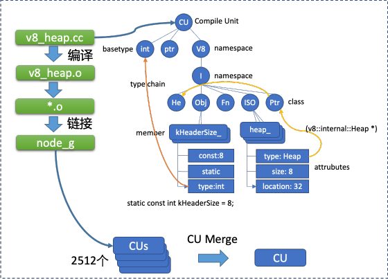

# 调试信息 (Dwarf)

## 对象的自动布局信息

Node 使用不同的 V8 版本，这些版本在对象支持上都有差异。
部分对象还采用 Torque 自动生成，但是最终还是需要产出成 C++ 的源代码，并编译到 node 二进制中。

Noslate Debugger 从编译器产出的 DebugInfo(调试信息) 中获取到对象的 Layout 信息，并自动产生对应的对象的解析函数、DebugPrint等实现。

<div style={{maxWidth: "800px"}} >


</div>

## 源代码到对象显示

DebugInfo 中保存了 c++ 类、结构体、枚举值等诸多调试信息，这些调试信息被 `gdb`/`lldb` 等调试器用于解析内存区块，解析出类、结构体等用户易读的内容。
要显示任意 Node.js / V8 引擎所使用的 c++ 结构体对象，需要从调试信息中找到对应的结构体子树，其子树叶子描述了这个结构体的所有 member 所在内存的偏移地址，类型，大小等详细信息。V8 使用的多数对象都继承自 `v8::internal::HeapObject`，它是一个系统 Pointer 字宽大小的 C++ 类定义，但不同的对象有不同的 Layout，其信息则由该子树上所对应的枚举值所定义。譬如 `Oddbal` 对象中，它的 `ToString` 描述会由 `kToStringOffset = 16` 描述，这个值在不同的 V8 实现中可能不同，但是从 DebugInfo 中可以获取正确的值。

Noslate Debugger 正是利用了这些结构体信息，编写了 Shadow 引擎用于解析 V8 对象和执行 Corefile 里的分析时逻辑。

<div style={{maxWidth: "600px"}} >



</div>

## 合并冗余节点

一个完全构建的 Node.js Debug 版本，可达 2.4 GB，其中包含 23577 万 DIE，76883 万属性，这样的文件大小无法进行分发。

Noslate Debugger 将冗余的调试信息节点进行了 CU 合并。合并后，node.typ 文件仅有 150MB，包含全量 189 万 DIE，546 万属性。

<div>


</div>

其中也包括了大量系统头文件、依赖头文件里定义的调试信息，所以目前线上调试信息库所使用的 node.typ 版本，是进一步精简的版本，在 10MB 左右更加利于分发，
其包含 44 万 DIE，137 万属性。

```bash
$ls -al node.typ
-rw------- 1 zlei users 13119741 Sep 27 11:00 node.typ
```

```bash
$dwf -i node.typ
section .debug_abbrev, addr(0x7f17b5b653be), size(8219)
section .debug_info, addr(0x7f17b5b673d9), size(4404799)
section .debug_line, addr(0x7f17b67dd850), size(43181)
section .debug_str, addr(0x7f17b5f9aa18), size(8662584)
dwf>sum .
------ TAG (448021) -----
  DW_TAG_unspecified_type : 1
  DW_TAG_compile_unit : 1
  DW_TAG_volatile_type : 12
  DW_TAG_ptr_to_member_type : 12
  DW_TAG_base_type : 20
  DW_TAG_lexical_block : 85
  DW_TAG_subroutine_type : 92
  DW_TAG_namespace : 244
  DW_TAG_array_type : 318
  DW_TAG_union_type : 533
  DW_TAG_GNU_template_template_param : 661
  DW_TAG_rvalue_reference_type : 973
  DW_TAG_enumeration_type : 2148
  DW_TAG_variable : 3058
  DW_TAG_GNU_template_parameter_pack : 3657
  DW_TAG_formal_parameter : 4972
  DW_TAG_subprogram : 7666
  DW_TAG_imported_declaration : 7862
  DW_TAG_pointer_type : 8012
  DW_TAG_reference_type : 9668
  DW_TAG_template_value_param : 12076
  DW_TAG_const_type : 19645
  DW_TAG_inheritance : 21288
  DW_TAG_enumerator : 21788
  DW_TAG_class_type : 22090
  DW_TAG_structure_type : 38440
  DW_TAG_member : 54438
  DW_TAG_padding : 65946
  DW_TAG_template_type_param : 70986
  DW_TAG_typedef : 71329
------ Attributes (1371821) -----
  DW_AT_producer : 1
  DW_AT_GNU_vector : 1
  DW_AT_comp_dir : 1
  DW_AT_language : 1
  DW_AT_high_pc : 1
  DW_AT_stmt_list : 1
  DW_AT_low_pc : 1
  DW_AT_location : 4
  DW_AT_export_symbols : 5
  DW_AT_use_location : 8
  DW_AT_object_pointer : 16
  DW_AT_prototyped : 33
  DW_AT_specification : 41
  DW_AT_bit_size : 123
  DW_AT_bit_offset : 123
  DW_AT_enum_class : 401
  DW_AT_GNU_template_name : 661
  DW_AT_const_expr : 1439
  DW_AT_default_value : 1924
  DW_AT_encoding : 2168
  DW_AT_containing_type : 3265
  DW_AT_alignment : 4243
  DW_AT_artificial : 5263
  DW_AT_linkage_name : 7004
  DW_AT_import : 7862
  DW_AT_external : 11680
  DW_AT_declaration : 19833
  DW_AT_const_value : 44726
  DW_AT_sibling : 61297
  DW_AT_accessibility : 61776
  DW_AT_data_member_location : 62473
  DW_AT_byte_size : 76952
  DW_AT_decl_column : 140774
  DW_AT_decl_line : 140778
  DW_AT_decl_file : 140778
  DW_AT_type : 278262
  DW_AT_name : 297902
dwf>
```


## 调试信息库

Noslate Debugger 的 CI 会自动跟踪 Node.js、Alinode、Aworker 的官方发布，并自动构建相应的调试信息 `node.typ` 文件。
这个多版本仓库已经编入 `andb` 工具中，在调试 Corefile 时会自动匹配和下载。

