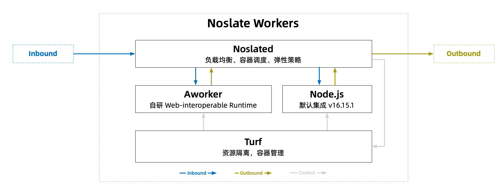

# 

Noslate Workers - 轻量 JavaScript Serverless 解决方案

依托淘宝 Node.js 团队自研的 Web-interoperable 运行时 Aworker，提供了一个 轻量，近乎 0 冷启动 的 JavaScript Serverless 运行环境。通过它，可以轻松的在已有的架构中集成 Serverless 能力。

### Aworker
提供 Web API 标准的 Web-interoperable JavaScript 运行时，通过 Startup Snapshot 和 WarmFork 能力，
实现了更快的水平及垂直扩容，能够在毫秒级启动并处理流量，具备更高的弹性效率。

[详细了解 Aworker](./aworker/intro)

### Noslated
Noslate Workers Container Deamon，提供了 Serverless 所需的 Worker 实例调度、弹性扩容、配置管理、流量管理等能力。

[详细了解 Noslated](./noslated/intro)

### Turf
在 Noslate Workers 架构下，调度单元从之前的容器下沉到了进程，因此资源隔离是很重要的一点。我们基于 Linux 系统提供的能力，
实现对执行单元的最小化授权以及资源使用限制，同时用户接口设计遵从 OCI 规范，提供 Worker 实例管理能力。作为基础组件，
负责管理各 Worker 实例执行单元的生命周期以及资源使用情况。

[详细了解 Turf](./turf/intro)

