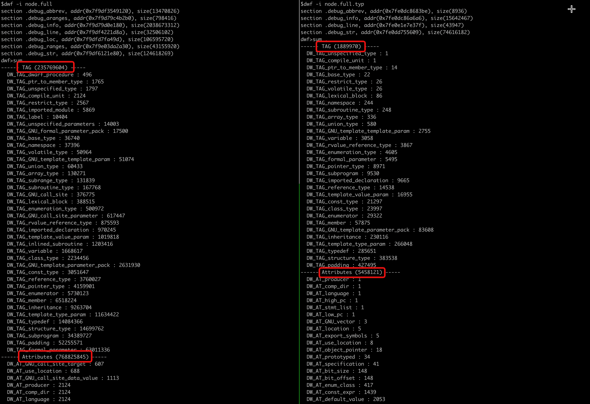

# Debug info (Dwarf)

## Auto layout information for objects

Node uses different V8 versions that differ in object support.
Some objects are also automatically generated using Torque, but eventually the C++ source code will be generated and compiled into the node binary.

Noslate Debugger obtains the Layout information of the object from the DebugInfo (debugging information) produced by the compiler, and automatically generates the corresponding object parsing function, DebugPrint and other implementations.

<div style={{maxWidth: "800px"}} >


</div>

## Display of source code to objects

DebugInfo stores a lot of debugging information such as C++ classes, structures, enumeration values, etc. These debugging information are used by debuggers such as `gdb`/`lldb` to parse memory blocks and parse out user-readable content such as classes and structures .
To display the c++ structure object used by any Node.js / V8 engine, you need to find the corresponding structure subtree from the debugging information. The subtree tree describes the offset address and type of the memory where all members of this structure are located , size and other details. Most objects used by V8 inherit from `v8::internal::HeapObject`, which is a C++ class definition of the system Pointer word width, but different objects have different layouts, and their information is corresponding to the subtree. Defined by the enumeration value of . For example, in the `Oddbal` object, its `ToString` description will be described by `kToStringOffset = 16`, this value may be different in different V8 implementations, but the correct value can be obtained from DebugInfo.

Noslate Debugger uses these structural information to write the Shadow engine for parsing V8 objects and executing the analysis logic in the Corefile.

<div style={{maxWidth: "600px"}} >


</div>

## Merge redundant nodes

A fully built Node.js Debug build up to 2.4 GB with 235.77 million DIEs, 768.83 million properties, a file size that cannot be distributed.

Noslate Debugger merges redundant debug info nodes into CU. After merging, the node.typ file is only 150MB, containing a total of 1.89 million DIEs and 5.46 million attributes.

<div>



</div>

It also includes a large number of system header files and the debugging information defined in the dependency header files, so the node.typ version used by the online debugging information library is a further simplified version, which is more conducive to distribution at about 10MB.
It contains 440,000 DIEs and 1.37 million attributes.

```bash
$ls -al node.typ
-rw------- 1 zlei users 13119741 Sep 27 11:00 node.typ
```

```bash
$dwf -i node.typ
section .debug_abbrev, addr(0x7f17b5b653be), size(8219)
section .debug_info, addr(0x7f17b5b673d9), size(4404799)
section .debug_line, addr(0x7f17b67dd850), size(43181)
section .debug_str, addr(0x7f17b5f9aa18), size(8662584)
dwf>sum .
------ TAG (448021) -----
  DW_TAG_unspecified_type : 1
  DW_TAG_compile_unit : 1
  DW_TAG_volatile_type : 12
  DW_TAG_ptr_to_member_type : 12
  DW_TAG_base_type : 20
  DW_TAG_lexical_block : 85
  DW_TAG_subroutine_type : 92
  DW_TAG_namespace : 244
  DW_TAG_array_type : 318
  DW_TAG_union_type : 533
  DW_TAG_GNU_template_template_param : 661
  DW_TAG_rvalue_reference_type : 973
  DW_TAG_enumeration_type : 2148
  DW_TAG_variable : 3058
  DW_TAG_GNU_template_parameter_pack : 3657
  DW_TAG_formal_parameter : 4972
  DW_TAG_subprogram : 7666
  DW_TAG_imported_declaration : 7862
  DW_TAG_pointer_type : 8012
  DW_TAG_reference_type : 9668
  DW_TAG_template_value_param : 12076
  DW_TAG_const_type : 19645
  DW_TAG_inheritance : 21288
  DW_TAG_enumerator : 21788
  DW_TAG_class_type : 22090
  DW_TAG_structure_type : 38440
  DW_TAG_member : 54438
  DW_TAG_padding : 65946
  DW_TAG_template_type_param : 70986
  DW_TAG_typedef : 71329
------ Attributes (1371821) -----
  DW_AT_producer : 1
  DW_AT_GNU_vector : 1
  DW_AT_comp_dir : 1
  DW_AT_language : 1
  DW_AT_high_pc : 1
  DW_AT_stmt_list : 1
  DW_AT_low_pc : 1
  DW_AT_location : 4
  DW_AT_export_symbols : 5
  DW_AT_use_location : 8
  DW_AT_object_pointer : 16
  DW_AT_prototyped : 33
  DW_AT_specification : 41
  DW_AT_bit_size : 123
  DW_AT_bit_offset : 123
  DW_AT_enum_class : 401
  DW_AT_GNU_template_name : 661
  DW_AT_const_expr : 1439
  DW_AT_default_value : 1924
  DW_AT_encoding : 2168
  DW_AT_containing_type : 3265
  DW_AT_alignment : 4243
  DW_AT_artificial : 5263
  DW_AT_linkage_name : 7004
  DW_AT_import : 7862
  DW_AT_external : 11680
  DW_AT_declaration : 19833
  DW_AT_const_value : 44726
  DW_AT_sibling : 61297
  DW_AT_accessibility : 61776
  DW_AT_data_member_location : 62473
  DW_AT_byte_size : 76952
  DW_AT_decl_column : 140774
  DW_AT_decl_line : 140778
  DW_AT_decl_file : 140778
  DW_AT_type : 278262
  DW_AT_name : 297902
dwf>
```


## Debug info repository

The CI of Noslate Debugger will automatically track the official releases of Node.js, Alinode, and Aworker, and automatically build the corresponding debug information `node.typ` file.
This multi-version repository has been compiled into the `andb` tool, which is automatically matched and downloaded when debugging the Corefile.

