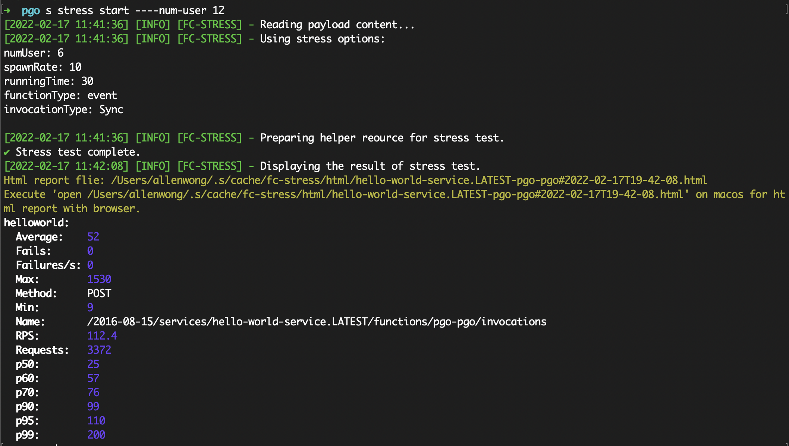

# User code execution acceleration

PGO (Profile Guided Optimization) is a technology that compiles and optimizes according to runtime Profiling Data. Here we draw on this concept. It mainly generates a cache file by collecting the hot data in the startup phase after executing it once, and then starting by loading an efficient cache file to obtain a 100% to 200% increase in the user code cold startup optimization effect.

## Main principle

### Cache of require relationship

When Node.js loaded user code, we found that a lot of disk IO was used to find node_modules, consuming a lot of startup time.

`require` an `a` in a file, it will go through a series of pathfinding, and finally get the absolute path of the corresponding `a` corresponding file; and also `require` an `a` in another file , the absolute path obtained may be different. PGO associates the result relationships obtained by `require` various strings in different files one by one, and obtains a two-dimensional map. With this relational data, the `require` function is modified, and a piece of logic is added before the path-finding logic, that is, the corresponding relationship is searched from the Map. If the corresponding relationship is found, the corresponding content will be returned directly; if not found, The original path finding logic is used as the backstop, thereby achieving acceleration.
### ByteCode Cache

In the logic of repeated `require`, repeatedly judging whether the file exists is a grouping logic, and another grouping problem is repeatedly reading fragmented files.

In addition to the previously mentioned relationships, PGO's `Require Cache` stores:

1. Text information of the source file;
2. The V8 byte code compiled from the source file.

These information and relationship information are structured and stored in a cache file, so that once we load the cache file, we can use the Map directly without going through any deserialization steps.

With such a file, we only need to load the cache file once the process has just started. Then every time you require, the corresponding file is found directly from the cache relationship, and then the source code text and byte code of the file are obtained from the cache, and loaded directly.

In doing so, all we save is:

+ Pathfinding time (repeated statx, the encapsulation logic in Node.js is more complicated);
+ Time to read files (repeated openat, more complicated logic encapsulated by Node.js);
+ Source code text compilation execution is reduced to byte code compilation execution.


## API Usage

Divided into two parts: recording files, and loading cache files.

**Recording cache files:**

Use the following statement to record after all modules are loaded, so that the `require_cache.strrc` cache file will appear in your working directory.

```javascript
const rrc = require('alinode/relational_require_cache');
const pgoEntries = [ process.cwd(), path.join(__dirname, 'node_modules') ];
rrc.record(pgoEntries);
```

**Load the cache file:**

Execute the following statement at the beginning of Node.js execution to enable caching.

```javascript
const rrc = require('alinode/relational_require_cache');
const pgoFilePath = path.join(__dirname, 'require_cache.strrc');
const pgoEntries = [ process.cwd(), path.join(__dirname, 'node_modules') ];
if (fs.existsSync(pgoFilePath)) {
  rrc.load(pgoFilePath, pgoEntries);
}
```

For large-scale integration use, you can refer to the implementation of [PGO components](https://github.com/midwayjs/pgo) of Serverless Devs.

## Use in Alibaba Cloud Function Computing

At present, the Noslate release version has been fully provided in Alibaba Cloud Function Compute since Node.js 14, and it can be used as long as Node.js 14 is used.

It is currently integrated with [Serverless Devs](https://www.serverless-devs.com/) and can be used directly through Serverless Devs `s cli`.

1. Add `pre-deploy` to service actions in `s.yaml`, configure the run command as `s cli pgo`, as shown in the figure


2. Change runtime in `s.yaml` to `nodejs14`

3. deploy function
```shell
s deploy
```

4. invoke function
```shell
s cli fc-api invokeFunction --serviceName fctest --functionName functest1 --event '{}'
```

### Parameters

Parameters can be passed through `s cli pgo gen --parameter key parameter value`

+ `remove-nm`: automatically remove node_modules after building pgo, `s cli pgo gen --remove-nm`

### Generate detailed process
#### 1. Generate PGO files based on the current project code

#### 2. Save the generated PGO file to the project directory

#### 3. Online use of PGO files to speed up startup


## After optimization

We use a simple test program to verify the actual effect, the following is an example.

```javascript
require('eslint');
require('lodash');
require('midway');
require('webpack');
require('jsdom');
require('mysql2');
require('sequelize');

exports.handler = (event, context, callback) => {
  callback(null, {
    versions: process.versions
  });
}
```

As you can see, when PGO is not used and only the Production dependencies are installed, the request execution time on cold start reaches 3069.39 ms.


### PGO optimized cold-start

Add the PGO cache file to the existing function code package. The following figure shows that the cold start using the PGO cache reduces the time to 1254.43 ms. This is equivalent to a 61% reduction in cold start time and an increase of about 150%.


### Boot with PGO cache only

In most cases, if your business code is controllable and all module dependencies have been introduced in the initialization phase, you can also try to keep only the PGO cache file to start (ie delete node_modules). Because the size of the code package is reduced by at least half and the number of broken files is reduced, this will greatly reduce the time for downloading the code package and decompressing the code package, which is reflected in the stress test scenario similar to the real situation. Indicators have a large proportion of the decline.

Additional PGO caches for existing code packages:



Start with only the PGO cache (remove node_modules):


