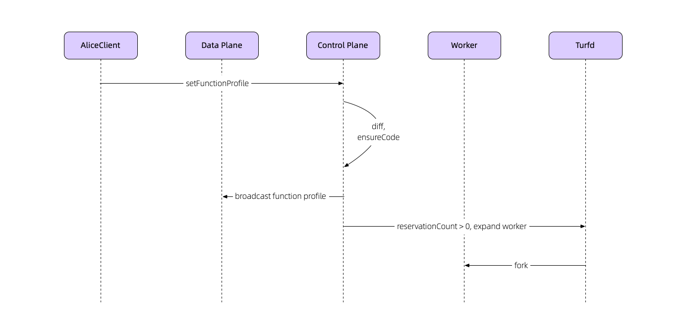

# Noslated

Noslate Container Deamon, as the core of the Noslate Serverless solution, provides Worker instance scheduling, elastic expansion, configuration management, traffic management and other capabilities required by Serverless.

It consists of two roles:
1. Control Plane
2. Data Plane

## Control Plane
As the brain of Noslated, it is responsible for ensuring the normal operation of the entire system. It integrates the operating indicators of the current system and evaluates the current water level, And according to the [Established Strategy](noslate_workers/references/scale.md) to achieve dynamic allocation of the number of Worker instances.

### Configuration management
Meta information and service routing configuration of Worker functions are managed by Control Plane and distributed to Data Plane for use. When the received configuration is updated, it will be compared with the existing configuration to update the Worker function code package and the corresponding Worker instance.

There are three configurations in the Noslated system:
1. [Worker function configuration](noslate_workers/references/function_profile)
2. [Service routing configuration](noslate_workers/references/service_profile)
3. [System Configuration](noslate_workers/references/system_config)

Take updating the Worker function configuration as an example:

## Data Plane
Data Plane is Noslated's main request link. All traffic flows through the corresponding Worker instance through Data Plane. After getting the Worker function call instruction, it decides which Worker instance to send the data to.

In addition, the external requests of the Worker instance are executed by Data Plane as a proxy.
